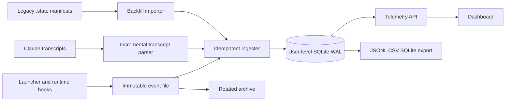

# Telemetry v2: Central Run and Task Tracing

**Status:** Implemented locally - validation and operator rollout complete  
**Date:** 2026-07-24  
**Owners:** linear-agents platform  
**Related:** JOI-75 (worktree-per-dev-run), JOI-76 (run lifecycle),
`docs/prd/telemetry-panel-prd.md`, `docs/plans/flowdb-learning-loop.md`

## 1. Problem

The current telemetry pipeline is auditable but does not have a durable,
authoritative identity model:

1. `run-manifest.mjs` writes mutable JSON manifests to `.state/runs/` in the
   linear-agents checkout.
2. `telemetry-server.mjs` calls `ledger.scanRuns()` for dashboard requests.
3. The ledger scans manifests and transcript files, associates them with runs,
   parses usage, and recalculates cost from `config/models.json`.
4. `flow-db.mjs` provides a separate SQLite projection, but it is populated
   manually, lives under `.state/flowdb/`, stores only a subset of telemetry,
   and is not the data source for the main dashboard.

This breaks down when an agent starts in one checkout and moves to a Git
worktree. A branch is a changing observation, not a run identity. A worktree
can also be attached to a branch or use detached HEAD, so `gitBranch` cannot
stand in for workspace identity.

The system also collapses task provenance into one final `taskId`, silently
returns zero cost for unknown model pricing, and can show a running cold-start
session as `$0.00` until a time-based transcript match succeeds.

## 2. Verified Findings

The findings below were verified against the current code and local runtime
artifacts. Existing automated tests were not rerun during this planning pass.

### 2.1 Repository and worktree identity are currently incorrect

- `run-manifest.mjs start` records `cwd` once from `process.cwd()`.
- Its Git command runs with `cwd` fixed to the linear-agents source root, not
  the recorded run cwd. `cwd` and `gitBranch` can therefore describe different
  repositories.
- `run-manifest.mjs end` does not refresh repository, worktree, ref, or HEAD
  metadata.
- Claude Code transcript events do contain the missing evidence: changing
  `cwd` and `gitBranch`, plus `relocated` and `worktree-state` events with the
  worktree path and branch.

Real example, FOC-36:

- Manifest: run `2026-07-24T08-04-44-dev`, `cwd=.../office`,
  `gitBranch=main`, `taskIdAuto=FOC-36`.
- Transcript at session start: the same session reports `gitBranch=dev`.
- The session then emits `worktree-state` and moves to
  `office/.claude/worktrees/foc-36-design-system` on
  `foc-36-design-system`.
- The manifest remains unchanged.

The task attribution is usable in this example, but the repository/ref fields
shown by the dashboard are not.

### 2.2 Live transcript discovery still depends on time

For session-less manifests, the ledger scans all project hash directories under
the squad config and assigns transcript files by birth time. The active-run
upper bound is still `startedAt + 120s`.

The FOC-36 transcript appeared about 236 seconds after its manifest start. The
running session therefore falls outside that discovery window and can be shown
with zero usage/cost. A completed run has a wider `endedAt` bound and may be
recovered later, but that association is calculated during a scan and is not
persisted as an authoritative link.

### 2.3 Task attribution has no provenance timeline

Current precedence is effectively:

1. explicit `LA_TASK_ID` from dashboard launch;
2. `taskIdAuto` written by `tag`/`set-task` after the squad picks a task;
3. task inferred from kickoff text;
4. task inferred from branch;
5. untagged.

The aggregate exposes some of these values, but the manifest does not retain a
history of when the task link became active, why it was chosen, or its
confidence. This prevents accurate attribution when a session is resumed,
changes task, or contains pre-pick turns.

Branch inference also supports only FEN/PISI/JOI, while current runs include
FOC tasks. Explicit tags cover many of these runs, but branch-based recovery is
incomplete by construction.

### 2.4 Cost is reproducible but not historically explicit

The positive property must be preserved: token usage comes from runtime logs,
not from agent self-reporting.

However:

- dashboard reads cause repeated filesystem discovery and parsing;
- changing `models.json` changes all historical estimates;
- unknown model pricing returns numeric zero without a data-quality warning;
- FlowDB stores a calculated `cost_usd` but no pricing snapshot/version.

## 3. Goals

1. Give every run, session, task link, repository, worktree, ref, turn, and
   usage record a durable identity with explicit provenance.
2. Make dashboard reads pure SQLite queries. No full manifest/transcript scan
   may run on a normal GET request.
3. Correctly trace a session that moves from a source checkout to one or more
   worktrees, including detached HEAD.
4. Attribute usage to the task active at the turn timestamp. Explicit task
   links are authoritative; inferred legacy links remain visible as uncertain.
5. Preserve raw runtime transcripts as audit evidence and as a rebuild source.
6. Show both the historical estimate using the run's pricing snapshot and an
   optional estimate using current prices.
7. Recover safely from database lock/unavailability through an idempotent file
   spool.
8. Support deterministic backfill and export without modifying source logs.

## 4. Non-goals

- A multi-user cloud telemetry service in v1.
- Cross-machine synchronization in v1. The schema must include `host_id` so a
  future collector can add it without changing identities.
- Storing complete prompts, responses, or tool payloads in the core telemetry
  tables. Raw transcripts remain external; indexed full text is an optional
  Flow/learning concern with its own retention policy.
- Inferring task identity from arbitrary source code or commit messages.
- Replacing OpenRouter billing reconciliation. Provider activity remains an
  independent financial cross-check.

## 5. Product Decisions

The following decisions were approved during planning:

| Decision | Selected behavior |
|---|---|
| Database scope | One user-level database per computer |
| Source of truth | Raw logs/events plus a rebuildable SQLite index |
| Historical pricing | Default as-run estimate plus optional current-price revaluation |
| Task identity | Explicit link authoritative; branch only a legacy fallback with confidence |
| Manifest retention | Idempotent spool, rotation, and JSONL/CSV/SQLite export |

Default paths:

```text
%LOCALAPPDATA%/linear-agents/telemetry/telemetry.sqlite
%LOCALAPPDATA%/linear-agents/telemetry/spool/pending/
%LOCALAPPDATA%/linear-agents/telemetry/spool/archive/YYYY-MM/
```

All paths are configurable through `LA_TELEMETRY_HOME` and
`LA_TELEMETRY_DB` for tests and future remote runners.

## 6. Identity Model

### 6.1 Run and session

- `run_id`: generated by the launcher; stable across workspace relocation.
- `session_id`: runtime session ID obtained at source, linked to `run_id` by a
  session-start event rather than by time-window inference.
- One run normally owns one lead session. The schema allows additional linked
  sessions for resume/recovery without overloading `run_id`.
- Subagent IDs remain children of the session and carry their attribution role.

The implementation must first verify the Claude Code SessionStart hook payload
and inherited `LA_RUN_ID`. If that runtime contract is unavailable, use the
runtime session registry as the fallback. Birth-time matching remains import
logic for legacy data only, never the primary path for new runs.

### 6.2 Repository, worktree, and Git ref

These are separate dimensions:

- `repository_id`: stable local identity derived from canonical
  `git rev-parse --git-common-dir`, plus a normalized remote fingerprint when
  available. Worktrees of the same repository share this ID.
- `worktree_id`: canonical worktree path plus its Git dir identity.
- `ref_type`: `branch`, `tag`, `detached`, or `unknown`.
- `ref_name`: symbolic ref when present; null for detached HEAD.
- `head_sha`: immutable observed commit.

A run has a timeline of workspace observations. It does not have one mutable
`gitBranch` fact. Projections may expose `launchWorkspace` and
`currentWorkspace`, while the detail view shows the full relocation history.

Observation sources, strongest first:

1. explicit runtime worktree/session event;
2. Git probe executed in the event's actual `cwd`;
3. transcript line metadata;
4. legacy manifest snapshot.

### 6.3 Task/work-item link

Task links are temporal and provenance-aware:

- `task_id`: normalized namespaced identity, for example
  `linear:jointhubs:FOC-36`.
- `role`: `primary` or `related`.
- `valid_from` / `valid_to`: attribution interval.
- `source`: `launch`, `agent_pick`, `manual`, `kickoff_inference`, or
  `branch_inference`.
- `confidence`: `1.0` for explicit sources; lower for legacy inference.
- `supersedes_link_id`: correction audit trail.

Usage is assigned to the primary task link active at the turn timestamp. Turns
before a task is picked remain untagged instead of being retroactively charged
unless a deliberate manual correction is recorded.

Branch and kickoff inference may populate legacy backfill, but they must never
override an explicit link and must be marked `inferred` in API/UI output.

## 7. Event and Storage Architecture



### 7.1 Write path

Every lifecycle change is an immutable event envelope:

```json
{
  "schemaVersion": 1,
  "eventId": "uuid",
  "eventType": "workspace.observed",
  "runId": "2026-07-24T08-04-44-dev",
  "observedAt": "2026-07-24T08:11:32.145Z",
  "hostId": "local-host-id",
  "source": { "kind": "claude-hook", "path": null, "offset": null },
  "payload": {}
}
```

Writer behavior:

1. write a temp event file and atomically rename it into `spool/pending`;
2. attempt a short SQLite transaction with WAL and `busy_timeout`;
3. commit the event and all projection updates atomically;
4. move the event file to the dated archive;
5. on lock/error, leave it pending and return a non-fatal warning;
6. reconcile pending files at server startup and on a lightweight interval.

`event_id` is globally unique. Source-derived records also have a uniqueness
constraint on source fingerprint and byte offset, making retries and backfill
idempotent.

### 7.2 Transcript ingestion

The ingester records, per source file:

- canonical path and file identity;
- last parsed byte offset;
- size/mtime/fingerprint;
- linked session and run;
- parse status and last error.

Only appended bytes are parsed during normal operation. Full parsing is used
for first import, repair, or a detected file rewrite. The parser extracts:

- session/worktree relocation events;
- assistant usage and model;
- subagent ID and attribution role;
- timestamp and source offset;
- optional non-sensitive tool category metadata.

The core store does not duplicate prompt/response text.

### 7.3 Read path

`telemetry-server.mjs` opens the database read-only for GET handlers. The API
queries projections and never calls `ledger.scanRuns()` during a normal read.

Ingestion/reconciliation is a separate startup/background responsibility. A
health endpoint exposes backlog age, pending event count, transcript lag,
unknown pricing, inferred task links, orphan sessions, and zombie runs.

## 8. Proposed Schema

The exact DDL belongs to the implementation plan, but these contracts are
required:

| Table | Purpose |
|---|---|
| `schema_migrations` | Ordered, transactional database migrations |
| `events` | Immutable event envelope and provenance |
| `hosts` | Stable local/remote runner identity |
| `runs` | Current run lifecycle projection |
| `sessions` / `run_sessions` | Runtime sessions and run links |
| `repositories` | Stable common Git repository identity |
| `worktrees` | Worktree identity and repository relationship |
| `workspace_observations` | Time-ordered cwd/ref/HEAD/worktree facts |
| `work_items` | Namespaced Linear or planning task identity |
| `run_task_links` | Temporal task attribution with source/confidence |
| `transcript_sources` | Incremental parser cursor and file provenance |
| `turns` | Lead/subagent turn identity and attribution |
| `usage_facts` | Immutable input/output/cache token counts per turn/model |
| `price_sets` / `model_prices` | Versioned price snapshots |
| `cost_facts` | As-run estimate tied to usage and a price set |
| `data_quality_issues` | Durable anomaly status and resolution |

Important constraints:

- unique `(source_id, source_offset)` for transcript-derived facts;
- unique active primary task link per run and timestamp interval;
- foreign keys enabled;
- timestamps stored as UTC ISO-8601 plus validated ordering;
- no unknown price is represented as cost zero: cost is null and a
  `pricing_missing` issue is raised;
- cost can always be recomputed from `usage_facts` and any `price_set`.

## 9. Cost Semantics

The default dashboard value is **estimated cost at run time**:

1. On first pricing of a usage fact, snapshot the matching rates and source
   config hash into a versioned price set.
2. Store the derived as-run estimate linked to that set.
3. Preserve raw token usage as the primary fact.
4. Offer `pricing=current` for revaluation using the active model config.
5. Show `pricing_missing` instead of `$0.00` when model resolution fails.

Provider billing remains a separate reconciled measure. UI labels must
distinguish `estimated at run`, `revalued`, and `provider billed` values.

## 10. Data Quality and Observability

Required health signals:

- run without explicit task link;
- inferred task link and confidence;
- run without session link after a short startup grace period;
- session linked by legacy time heuristic;
- transcript parser lag and pending spool age;
- workspace observation older than the latest relocation event;
- missing model price;
- run still `running` without recent transcript/session activity;
- source file claimed by multiple runs;
- duplicate/replayed source event;
- as-run estimate versus provider billing divergence.

Every API run response includes a compact `dataQuality` object. The dashboard
must not encode uncertainty only as a generic `ambiguous` boolean.

## 11. Migration Plan

### Phase 0 - Contract spike and inventory

- Verify SessionStart/SessionEnd hook payloads and `LA_RUN_ID` inheritance.
- Verify runtime `sessions/*.json` fallback and worktree relocation events.
- Inventory current manifests, transcript roots, FlowDB rows, untagged runs,
  unknown models, and session-less runs.
- Finalize schema and failure/rollback contract.

Exit gate: a synthetic session and a real worktree session produce an exact
`run_id -> session_id` link without time matching.

### Phase 1 - Central store and dual write

- Add database migrations and event/spool writer.
- Write lifecycle and task-link events to the central store while preserving
  current `.state/runs` behavior.
- Add health and diagnostic CLI commands.
- Do not change dashboard reads yet.

Exit gate: killing/locking the database leaves replayable pending events; a
retry creates no duplicates.

### Phase 2 - Session and workspace timeline

- Add exact session bridge.
- Parse relocation/worktree events.
- Probe Git in the observed cwd and persist common repo, worktree, ref type,
  ref name, and HEAD SHA.
- Add task-link timeline and manual correction event.

Exit gate: two parallel DEV sessions in two worktrees have one repository ID,
two worktree IDs, distinct tasks/refs/HEADs, and no cross-attribution.

### Phase 3 - Incremental usage and pricing

- Add transcript cursors, turn/agent attribution, usage facts, price sets, and
  data-quality issues.
- Compare SQLite aggregates to the existing ledger on a fixed corpus.
- Add as-run/current price modes and unknown-model handling.

Exit gate: token counts match the ledger corpus exactly; priced costs match
within a documented floating-point tolerance; unknown models are not zero.

### Phase 4 - Database-backed API and FlowDB merge

- Switch `/api/runs`, `/api/live`, `/api/summary`, `/api/cost-per-task`, and
  `/api/flow` to SQLite projections behind a feature flag.
- Import useful FlowDB run/step metadata into the central schema.
- Keep full-text Flow search optional and separately retained.
- Remove request-time calls to `ledger.scanRuns()`.

Exit gate: API contract tests pass with manifest/transcript directories made
unavailable after ingestion.

### Phase 5 - Backfill, export, and rotation

- Backfill all legacy manifests and transcripts with provenance/confidence.
- Produce a reconciliation report before cutover.
- Add JSONL, CSV, and consistent SQLite snapshot export.
- Rotate archived event files by age/size only after verified ingest and
  backup; never delete runtime transcripts automatically in this phase.

Exit gate: deleting and rebuilding a test database from retained raw inputs
reproduces run/task/usage aggregates and anomaly classifications.

## 12. Acceptance Criteria

1. **Cross-repo correctness:** a launcher started from any configured repo
   records Git facts from that repo, never from the linear-agents source root.
2. **Worktree correctness:** after `EnterWorktree`, Run Detail shows the new
   worktree/ref/HEAD as current and preserves the launch workspace in history.
3. **Parallel isolation:** two DEV runs for different tasks in worktrees of the
   same repo never share session, task, usage, or current-workspace facts.
4. **Detached HEAD:** a detached worktree stores `ref_type=detached`, null
   `ref_name`, and a valid `head_sha` without inventing a branch.
5. **Exact session link:** a cold start whose transcript appears more than five
   minutes after launch is linked by runtime identity and shows live usage.
6. **Temporal task attribution:** turns before pick remain untagged; turns after
   explicit pick are charged to that task; a later correction is auditable.
7. **Legacy uncertainty:** branch/kickoff backfill is visibly inferred and can
   never override an explicit task link.
8. **Subagent attribution:** every usage fact belongs to lead or a stable
   subagent ID/role, with no double counting when files are reparsed.
9. **Pricing history:** changing `models.json` does not change the default
   as-run estimate; current-price revaluation changes without mutating usage.
10. **Missing pricing:** an unknown model produces usage plus a health issue and
    null estimated cost, never a misleading numeric zero.
11. **Read performance:** dashboard GET handlers execute bounded SQL and do not
    scan manifest/transcript trees.
12. **Crash recovery:** a locked/unavailable database leaves an atomic pending
    event that is ingested once after recovery.
13. **Backfill idempotency:** importing the same corpus twice changes no counts
    and creates no duplicate turns/cost.
14. **Export:** filtered JSONL/CSV exports and a consistent SQLite snapshot can
    be produced with optional path redaction.
15. **Rebuild:** a test database can be recreated from retained event archives
    and transcripts with matching aggregate checksums.

## 13. Test Strategy

- Unit tests: identity normalization, event validation, migration ordering,
  task-link intervals, Git ref states, pricing snapshots, idempotency keys.
- Fixture tests: original cwd -> worktree relocation, detached HEAD, resumed
  session, unknown model, subagent files, malformed/truncated JSONL.
- Concurrency tests: multiple writers, WAL lock, pending spool replay, two
  simultaneous worktree sessions.
- Differential tests: SQLite projections versus current ledger on a frozen
  transcript corpus.
- API contract tests: existing response compatibility plus data-quality and
  workspace-history additions.
- Recovery tests: corrupt pending event, interrupted migration, database
  deletion/rebuild, source transcript rewrite.
- Real smoke: launch two cheap DEV dry/smoke runs in separate worktrees and
  verify task/repo/worktree/session/cost end to end.

## 14. Rollout and Rollback

Feature flags:

- `LA_TELEMETRY_DUAL_WRITE=1`
- `LA_TELEMETRY_READ_SOURCE=files|sqlite`
- `LA_TELEMETRY_INGEST=0|1`

Rollout order is dual-write -> reconcile -> shadow-read comparison -> SQLite
read -> legacy file rotation. Rollback changes the read source to `files`; it
does not discard the database or pending events. Schema migrations require a
pre-migration SQLite snapshot and must be forward-only in production.

## 15. Security and Retention

- The database is local-user scoped and must not be exposed beyond loopback.
- File paths can reveal usernames and repository names; exports support
  redaction and keep the existing localhost-only constraint.
- The core database stores usage/identity metadata, not full prompt/response
  text or secrets.
- Raw transcripts keep their runtime ownership and retention policy.
- Optional Flow full-text indexing must have a separate explicit retention and
  deletion policy before it is merged into the central store.

## 16. Implementation Work Packages

1. Runtime session-link spike and event contract.
2. SQLite schema, migrations, event writer, and spool replay.
3. Repository/worktree/ref observation pipeline.
4. Temporal task-link model and legacy inference importer.
5. Incremental transcript/usage/subagent ingester.
6. Pricing snapshots, revaluation, and provider reconciliation hooks.
7. Database-backed telemetry API and health endpoint.
8. FlowDB migration, export, rotation, and rebuild tooling.
9. Differential test corpus and parallel-worktree end-to-end validation.

No implementation should start until this PRD and the Phase 0 runtime contract
are approved.